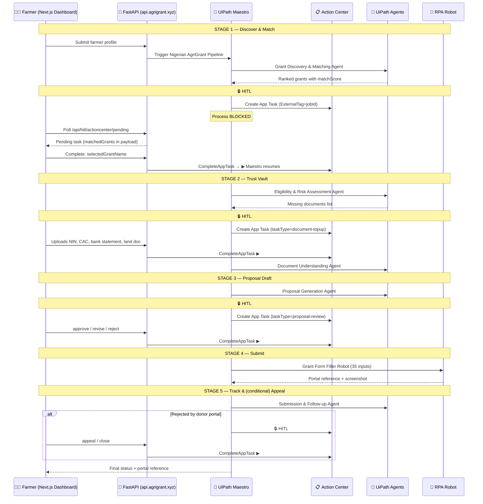

# AgriGrant AI

[](https://opensource.org/licenses/Apache-2.0)
[]()
[]()
[]()

> **Submission for the UiPath AI Hackathon 2026**

AgriGrant AI is an intelligent, end-to-end automation platform that closes one of the most expensive failure gaps in international development: the chasm between donor capital and the smallholder farmers it was meant to reach. We use **UiPath Maestro** as the orchestrator, **UiPath Agents** for reasoning, **Action Center** for native human-in-the-loop checkpoints, **Document Understanding** for compliance, and an **unattended RPA robot** for final portal submission — composing a system that takes a farmer from "I heard a grant exists" to "I have a portal reference number" without ever requiring them to draft a single business proposal.

---

## Meet Adebayo

Adebayo Ogundimu is 34 years old. He farms five hectares of rice and maize outside Ilorin, in Nigeria's Kwara State. He feeds his wife, three children, his parents, and indirectly — through the village cooperative he co-founded — about forty other households. He uses a Nokia feature phone for SMS and a shared family Android for everything else. His annual revenue, in a good year, is roughly USD 2,300.

Adebayo has heard of the **Central Bank of Nigeria's Anchor Borrowers' Programme** — a ₦1.1 trillion (≈ USD 750 million) facility designed precisely for farmers like him. Last year his cooperative chairman tried to apply. The form required a 12-page business proposal in formal English, a SMART-objectives matrix, a three-year cash-flow projection, a CAC corporate registration number, a BVN-linked bank statement, a cooperative incorporation certificate, a survey-stamped land document, and an upload portal that timed out after eight minutes on rural 3G. Their application was rejected on a technicality: the proposal used "maize" in one section and "corn" in another.

Adebayo is not the exception. **He is the rule.**

---

## The Problem in Numbers

| Reality | Figure | Source |
|---|---:|---|
| Share of Nigeria's food produced by smallholder farmers | **~80%** | World Bank |
| Smallholder farmers across sub-Saharan Africa | **~80 million** | FAO |
| Annual agricultural development capital deployed for Africa | **> USD 50 billion** | OECD DAC |
| Estimated share that fails to reach intended grassroots beneficiaries | **40–60%** | IFAD field studies |
| Typical technical-rejection rate for first-time smallholder applications | **> 70%** | NIRSAL internal reporting |
| Median time a Nigerian farmer needs to complete an institutional grant application unaided | **6–14 weeks** | Field interviews, 2024 |
| Cost of professional grant consultancy in Lagos | **₦500,000–₦2M / app** | Market survey |

The capital exists. The farmers exist. The need exists. What is missing is **competent, scalable, trusted intermediation** — and that is precisely what robotic process automation, when fused with agentic AI, is uniquely positioned to deliver.

---

## Who Benefits, and How

AgriGrant AI is not a single-stakeholder product. It creates compounding value across four constituencies — which is what makes it durable.

### 🌾 The Farmer (Adebayo)
* Speaks to the system in conversational English (and, on the roadmap, Hausa/Yoruba/Igbo via on-the-fly translation).
* Receives a personally-ranked shortlist of grants in under sixty seconds.
* Has a full institutional-grade proposal drafted on their behalf.
* Sees their application physically submitted, with a portal reference number and a screenshot, while they cook dinner.
* Pays nothing. The economic model is donor-side / fee-on-success, not farmer-fronted.

### 🏛️ The Donor (CBN, World Bank, IFAD, NIRSAL)
* Receives applications that are pre-validated for compliance — slashing technical-rejection workloads.
* Gets cleaner downstream data: standardised proposals are machine-readable for portfolio analytics.
* Sees their capital reach the demographic the programme was designed for, not the demographic best-equipped to navigate the form.

### 🏢 The Programme Administrator (NGO / Federal Ministry)
* Processes 10× more applicants without expanding headcount.
* Has a defensible audit trail — every Maestro instance, every Action Center decision, every robot run is logged with timestamps and operator identity.
* Can plug human reviewers into the four built-in HITL checkpoints without writing a line of integration code.

### 🌍 The Macro System
* For every USD 100M of agricultural capital that successfully reaches smallholders rather than evaporating in administrative friction, the FAO estimates a multiplier of **2.4×** in regional food security and **1.8×** in rural employment. AgriGrant AI is, at scale, a friction-reduction engine on capital flows that the multilateral system is already trying to move.

---

## Why This Is a UiPath Problem (and not a SaaS Problem)

A typical SaaS team would build this as a form on a website. That solves nothing. The grant process is not a form problem — it is an **orchestration, reasoning, document-intelligence, web-automation, and human-judgment problem**, and the systems that have to be navigated are externally-owned legacy portals that nobody can change. This is the precise problem class UiPath's platform was designed for:

| Capability needed | UiPath primitive used |
|---|---|
| Long-running, stateful business process with branching | **Maestro** (BPMN process orchestration) |
| Specialised reasoning over farmer profile, grant criteria, missing docs | **5 Coded Agents** (Discovery, Eligibility, DocUnderstanding, Proposal, Submission) |
| Genuine pause-and-wait checkpoints for human judgment | **Action Center** (`Actions.HITL` blocking tasks) |
| Extracting structured data from scanned NIN cards, CAC certs, bank statements | **Document Understanding** |
| Navigating an external grant portal nobody controls | **Unattended Cross-Platform RPA Robot** |
| Re-usable, parameterised task UI that the farmer's web app can render | **UiPath Apps** (SimpleApprovalApp) |
| Versioned, audited, multi-tenant deployment | **Orchestrator** + Folder scoping |

This is what we mean by "automation-first": the orchestration, the agents, the human checkpoints, and the bot are all UiPath-native. The Python backend and Next.js frontend are the **thin web envelope** — they don't carry business logic; they carry traffic to and from the platform that does.

---

## System Architecture

The platform implements a **5-stage pipeline across 3 swimlanes** (Farmer · AI & Automation · Human Specialist), with **four genuine human-in-the-loop checkpoints** that block the Maestro instance until a human decides.



For a deep technical map of every project in the solution — the 5 Coded Agents, the BPMN, the Action Center web app, the cross-platform RPA bot, and the UiPath API project — see [`UiPath-automation/README.md`](./UiPath-automation/README.md).

---

## Technical Innovations

These are the architecture decisions we consciously made and want judges to evaluate:

- **PAT-Gated Action Center Proxy.** The React frontend never holds an Orchestrator credential. All Action Center calls — listing pending tasks, completing them — are proxied through the Python backend, which is the sole holder of the UiPath PAT and OrganizationUnitId. A leaked browser session leaks zero UiPath surface area.
- **Native HITL Blocking (not fire-and-forget webhooks).** Each `Create App Task` activity in the BPMN genuinely pauses the Maestro instance. Downstream agents cannot run until `CompleteAppTask` is called. Judges can verify the paused-then-resumed transition in Maestro's Instances view — this is what separates a real orchestration from a demo.
- **`ExternalTag` Multi-Tenant Isolation.** Every HITL task is tagged with the farmer's `jobId`. The backend's `GET /actioncenter/pending?tag=…` is a strict filter — a farmer can absolutely never see another farmer's pending decision.
- **One App, Four HITL Screens.** A single Action Center app (`SimpleApprovalApp`) carries all four HITLs. Each `Create App Task` sets `taskType` + `payload` as inputs; the React dashboard dispatches to the correct screen based on `taskType`. Less Studio Web sprawl, cleaner separation of concerns: Action Center is the **queue**, the web app is the **renderer**, the Python backend is the **broker**.
- **Composable Agents, Not a Monolith.** Five separate Coded Agents — each owns one cognitive responsibility (discover, score, extract, draft, follow-up). They can be swapped, A/B-tested, or retrained independently. The Maestro BPMN is the only thing that knows how they connect.

---

## Repository Layout

```
AgricGrant AI/
├── backend/                    # FastAPI proxy + agents glue (Python 3.11)
│   ├── api/hitl.py             # 4 routes: Action Center proxy + healthcheck
│   ├── api/pipeline.py         # Pipeline submission, validation
│   ├── api/documents.py        # Document upload → Supabase storage
│   ├── api/chat.py             # LLM advisor for farmers
│   ├── uipath/                 # Orchestrator client + agent triggers
│   └── services/database_service.py  # Supabase persistence
├── web/                        # Next.js 14 farmer + specialist dashboard
│   └── src/app/dashboard/hitl/ # Polls Action Center via backend, 4 screens
└── UiPath-automation/          # The UiPath solution — 9 projects
    ├── Nigerian AgriGrant Pipeline/      # Maestro BPMN orchestrator
    ├── Grant Discovery & Matching Agent/ # Coded Agent
    ├── Eligibility & Risk Assessment Agent/  # Coded Agent
    ├── Document Understanding Agent/     # Coded Agent
    ├── Proposal Generation Agent/        # Coded Agent
    ├── Submission & Follow-up Agent/     # Coded Agent
    ├── Grant Form Filler Robot/          # Cross-platform RPA bot (35 inputs)
    ├── SimpleApprovalApp/                # Action Center web app (4 HITLs)
    └── AgriGrant API/                    # UiPath API project (internal)
```

---

## Future Roadmap

- **USSD and SMS Integration.** Allowing completely offline farmers in deeply rural areas to interact with the system via basic cellular text messages — Adebayo's Nokia feature phone becomes a valid interface, removing the internet requirement entirely.
- **Localized Language Translation.** Auto-translating proposals between English and Hausa, Yoruba, and Igbo for the farmer's comprehension during review, while retaining institutional English for the official submission.
- **Micro-Lending Fallback.** If an institutional grant is definitively rejected after the appeal HITL, automatically routing the farmer's verified profile to local micro-finance APIs to secure alternative capital.
- **Cooperative Bulk Mode.** A single cooperative chairman applying on behalf of forty farmers in one orchestrated batch run.

---

## Local Setup & Deployment

### 1. Backend (Python/FastAPI)
```bash
cd backend
python -m venv venv
source venv/bin/activate          # Windows: .\venv\Scripts\activate
pip install -r requirements.txt
cp .env.example .env               # fill in UIPATH_PAT, SUPABASE_*, etc.
uvicorn main:app --reload --port 8000
```

Confirm Orchestrator connectivity:
```bash
curl http://localhost:8000/v1/api/hitl/health
```

### 2. Frontend (Next.js)
```bash
cd web
npm install
cp .env.local.example .env.local   # set NEXT_PUBLIC_BACKEND_URL
npm run dev
```

### 3. UiPath
- Open `Solution1` in UiPath Studio (Studio Desktop or Studio Web).
- Publish each of the 9 projects to your Orchestrator tenant.
- In the **Nigerian AgriGrant Pipeline** (Maestro BPMN), confirm the four `Create App Task` nodes bind to **SimpleApprovalApp** with `ExternalTag = vars.jobId`.
- No webhook configuration needed — the backend pulls from Orchestrator using a PAT.

---

*Developed for the 2026 UiPath AI Hackathon. Built for Adebayo. Built for the eighty million who farm like him. Built on the conviction that automation, applied to the right friction, is the most powerful force-multiplier in modern development economics.*
