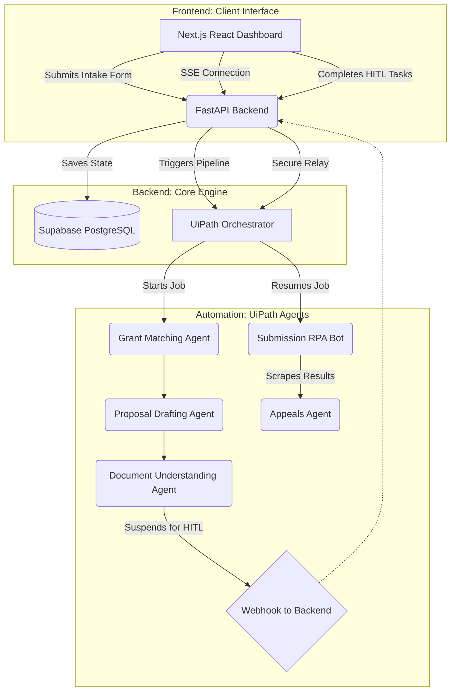

# AgriGrant AI

[](https://opensource.org/licenses/Apache-2.0)
[]()
[]()
[]()

> **Submission for the UiPath AI Hackathon 2026**

AgriGrant AI is an intelligent, end-to-end automation platform designed to bridge a critical funding gap in the developing world. By leveraging UiPath RPA, Document Understanding, and Agentic AI, we automate the highly bureaucratic process of discovering, qualifying for, and securing agricultural grants for smallholder farmers.

---

## The Context: Why This Matters

To understand the impact of AgriGrant AI, one must understand the paradox of the African agricultural sector.

Smallholder farmers form the backbone of the Nigerian economy, producing over 80% of the nation's food. However, these farmers operate largely in the informal sector. They lack formal financial history, high digital literacy, and the structural organization typical of Western commercial farming.

Simultaneously, billions of dollars in agricultural development grants are deployed annually by organizations such as the World Bank, USAID, and various Federal interventions (e.g., the Anchor Borrowers' Program). 

**The Disconnect:** The farmers who desperately need this capital are the least equipped to navigate the complex application processes. They do not know these grants exist, they cannot synthesize the formal business proposals required by international donors, and they frequently fail compliance checks due to unstructured documentation. Consequently, the capital often fails to reach the grassroots level.

AgriGrant AI solves this by acting as a highly intelligent, automated proxy between the rural farmer and the institutional donor.

---

## The AgriGrant Solution

We utilize a hybrid AI-RPA architecture to completely abstract the complexity of grant applications away from the user.

1. **Intelligent Onboarding & Matching:** A farmer completes a simplified, accessible intake form. A UiPath Agent cross-references their specific data (farm size, geographical location, crop type) against a live, constantly updated database of active grants to find perfect eligibility matches.
2. **AI-Driven Proposal Generation:** The system drafts a comprehensive, highly professional business proposal and financial budget breakdown. This is tailored dynamically to meet the strict linguistic and structural requirements of the specific grant provider.
3. **Document Verification (Document Understanding):** UiPath inspects unstructured uploaded files (identity documents, land ownership proofs, bank statements) to ensure compliance and validity before the application is ever submitted, drastically reducing technical rejection rates.
4. **Human-in-the-Loop (HITL):** We recognize that high-stakes financial applications require human oversight. Before submission, Orchestrator pauses the pipeline. The drafted proposal and compliance checklist are pushed to a secure React Dashboard where a grant specialist reviews and approves the data with a single click.
5. **Automated Submission & Strategic Appeals:** UiPath executes the final submission. If a grant provider rejects the application, our AI Agent scrapes the portal for the rejection rationale, evaluates the recoverability score, and formulates a strategy for a formal appeal.

---

## System Architecture

AgriGrant AI is built on a scalable, secure, multi-tenant architecture designed for enterprise-grade reliability.



* **The Engine (UiPath Orchestrator & Studio):** Drives the BPMN pipeline, executes the AI Document Understanding models, and orchestrates the web-scraping and submission bots.
* **The Brain (FastAPI Python Backend):** Handles complex data routing, orchestrates zero-exposure webhooks between the React frontend and UiPath Orchestrator, and manages the Supabase PostgreSQL database.
* **The Dashboard (Next.js & React):** A real-time, responsive web application serving as the primary interface for the farmer and the Grant Specialist to interact with the UiPath HITL tasks.

---

## Technical Innovations

To ensure enterprise-grade security and privacy, AgriGrant AI implements several advanced architectural patterns:

- **Zero-Exposure Webhooks:** The React frontend never communicates directly with UiPath. All HITL approvals are securely proxied through the Python backend, preventing malicious actors from intercepting Orchestrator URLs.
- **Strict Multi-Tenant Isolation:** The application isolates task polling using uniquely generated session identifiers. The backend dynamically filters webhook payloads, ensuring a user can absolutely never intercept or view another user's pipeline data or financial documents.

---

## Future Roadmap

Our vision for AgriGrant AI extends beyond the initial web interface:

- **USSD and SMS Integration:** Allowing completely offline farmers in deeply rural areas to interact with the UiPath Agent via basic cellular text messages, removing the requirement for internet access.
- **Localized Language Translation:** Automatically translating the drafted proposals from English to native languages (Hausa, Yoruba, Igbo) for the farmer's comprehension during the review stage, while retaining the English format for the official submission.
- **Micro-Lending Fallback Integration:** If an institutional grant is definitively rejected, automatically routing the farmer's verified profile to local micro-finance APIs to secure immediate, alternative capital.

---

## Local Setup & Deployment

### 1. Backend (Python/FastAPI)
```bash
cd backend
python -m venv venv
source venv/bin/activate
pip install -r requirements.txt
uvicorn main:app --reload --port 8000
```

### 2. Frontend (Next.js)
```bash
cd web
npm install
npm run dev
```

### 3. UiPath
- Open the `UiPath-automation` folder in UiPath Studio.
- Configure your Orchestrator credentials and publish the process.
- Map the webhooks to your live backend domain.

---

*Developed for the 2026 UiPath AI Hackathon. Empowering the foundation of the global agricultural economy through intelligent automation.*
