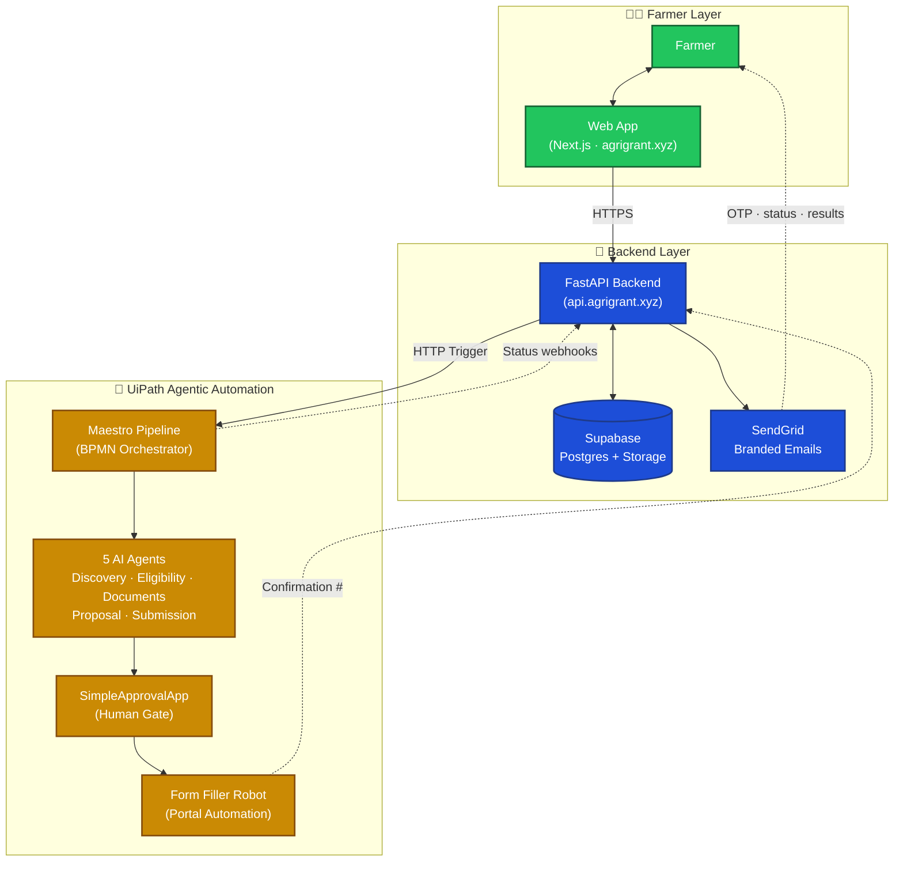
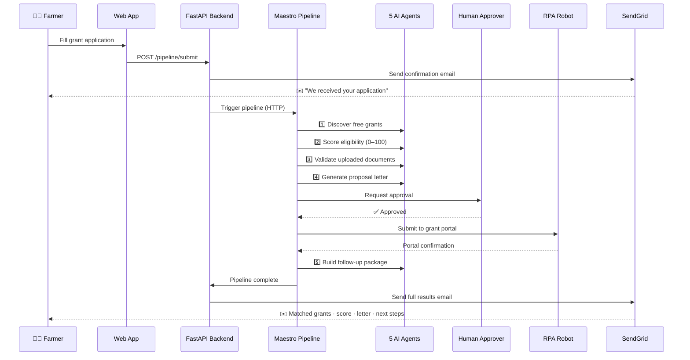

# AgriGrant AI

**AI-Powered Nigerian Agricultural Grant Discovery & Application System**

[](https://nextjs.org)
[](https://typescriptlang.org)
[](https://tailwindcss.com)
[](https://uipath.com)

---

## Overview

AgriGrant AI is an end-to-end intelligent platform that helps Nigerian smallholder farmers discover, assess eligibility for, and submit agricultural grant applications — in under 10 minutes.

The system is built on **UiPath Agentic Automation**, orchestrating five specialized AI agents across a BPMN pipeline. Each agent handles a distinct stage of the grant application process: discovery, eligibility scoring, document validation, proposal writing, and submission packaging.

---

## The Problem

Nigerian smallholder farmers lose significant agricultural grant funding annually due to:

- Limited awareness of available programs (CBN, NIRSAL, BOA, FMARD, state and international donors)
- Inability to self-assess eligibility against complex Nigerian compliance requirements (BVN, CAC, CRMS clean record, cooperative membership)
- No access to formal application letter writing at government standards
- Unclear submission channels — online portals vs. physical ministry offices
- Document preparation barriers (NIN, CAC certificate, bank statements, C of O, cooperative letters)

---

## Solution

AgriGrant AI removes these barriers through a five-agent AI pipeline:

1. **Discovers** matching grants from the web based on the farmer's specific profile
2. **Scores** eligibility (0–100) against Nigerian compliance requirements, with hard disqualifiers enforced
3. **Validates** uploaded documents (NIN, CAC, bank statements, C of O, cooperative letters)
4. **Generates** complete, print-ready application letters tailored to each grant body
5. **Packages** submission instructions, follow-up schedule, and delivers everything via email

---

## System Architecture

AgriGrant AI is composed of three layers: a farmer-facing web app, a FastAPI backend, and a UiPath Agentic Automation suite that does the heavy lifting.

### How the layers connect



### What happens when a farmer submits



### Detailed BPMN Process Flow (reference)

For implementers — full flow with every gateway, retry, timer event, and end-state. Judges can skip this.

> **Legend:** 🟢 Start · 🔵 AI Agent · 🟡 RPA Robot · 🟣 Human Task · ⏱️ Timer · ◇ Gateway · 🔴 Failure End · 🟢 Success End

```mermaid
flowchart TD
    %% ============== PHASE 1: INTAKE & VALIDATION ==============
    Start((🌱 Farmer Submits<br/>Grant Application))
    T1["⚙️ API<br/>Receive &amp; Validate<br/>Farm Application"]
    G1{"Is Application<br/>Data Complete?"}
    T2["⚙️ Submission &amp; Follow-up Agent<br/>Request Missing Information"]
    Tm1(["⏱️ Await Farmer<br/>Response 48hrs"])

    Start --> T1
    T1 --> G1
    G1 -->|No| T2
    T2 --> Tm1
    Tm1 --> T1

    %% ============== PHASE 2: GRANT DISCOVERY ==============
    T3["⚙️ Grant Discovery Agent<br/>Search &amp; Match Eligible Grants"]
    G2{"Were Matching<br/>Grants Found?"}
    T4["⚙️ Submission &amp; Follow-up Agent<br/>Notify No Matches"]
    End1((("❌ No Matching<br/>Grants Found")))

    G1 -->|Yes| T3
    T3 --> G2
    G2 -->|No| T4
    T4 --> End1

    %% ============== PHASE 3: ELIGIBILITY & RISK ==============
    T5["⚙️ Submission &amp; Follow-up Agent<br/>Present Matched Grants"]
    T6["👤 Farmer Selects Which<br/>Grant to Apply For"]
    T7["⚙️ Eligibility &amp; Risk Agent<br/>Deep-Dive Analysis"]
    G3{"Does Farmer Meet<br/>All Grant Criteria?"}
    T8["⚙️ Eligibility &amp; Risk Agent<br/>Analyze Other Options"]
    G4{"Are There Other<br/>Grants to Check?"}
    T9["⚙️ Submission &amp; Follow-up Agent<br/>Notify Requirements Gap"]
    End2((("❌ Process Ended<br/>Requirements Not Met")))

    G2 -->|Yes| T5
    T5 --> T6
    T6 --> T7
    T7 --> G3
    G3 -->|No| T8
    T8 --> G4
    G4 -->|Yes| T7
    G4 -->|No| T9
    T9 --> End2

    %% ============== PHASE 4: DOCUMENT VERIFICATION ==============
    T10["⚙️ Document Understanding Agent<br/>Check Required Docs"]
    G5{"Are Documents<br/>Required for Grant?"}
    T11["⚙️ Document Understanding Agent<br/>Identify Missing Docs"]
    T12["👤 Farmer Uploads Required<br/>Documents via Web App"]
    T13["⚙️ Document Understanding Agent<br/>Analyze Uploads"]
    T14["⚙️ Document Understanding Agent<br/>Prepare Document Package"]
    Err1((("⚠️ Document<br/>Analysis Failed")))
    Err2((("⚠️ Unclear Grant<br/>Requirement")))

    G3 -->|Yes| T10
    T10 --> G5
    G5 -->|Yes| T11
    T11 --> T12
    T12 --> T13
    T13 --> T14
    T13 -.->|error| Err1
    G5 -.->|unclear| Err2

    %% ============== PHASE 5: PROPOSAL GENERATION ==============
    T15["⚙️ Proposal Agent<br/>Collect Grant Details from KB"]
    T16["⚙️ Proposal Agent<br/>Query Eligibility &amp; Document Data"]
    T17["⚙️ Proposal Agent<br/>Compose Tailored Application"]
    T18["👤 Farmer Reviews Proposal<br/>in Web App"]
    G6{"Did Farmer Approve<br/>the Proposal?"}
    T19["⚙️ Proposal Agent<br/>Regenerate Based on Feedback"]
    T20["⚙️ Proposal Agent<br/>Package All Data &amp; Send to RPA"]
    G7{"Data<br/>Validated?"}
    T21["⚙️ Proposal Agent<br/>Request Correction Tier 1"]
    End3((("⏸️ Awaiting<br/>Farmer Input")))

    T14 --> T15
    G5 -->|No| T15
    T15 --> T16
    T16 --> T17
    T17 --> T18
    T18 --> G6
    G6 -->|No| T19
    T19 --> T18
    G6 -->|Yes| T20
    T20 --> G7
    G7 -->|NOT READY| T21
    T21 --> End3

    %% ============== PHASE 6: RPA SUBMISSION ==============
    T22["🤖 RPA Portal Submission Robot<br/>Query Portal"]
    T23["🤖 RPA Portal Submission Robot<br/>Fill &amp; Submit Form"]
    G8{"Submission<br/>Successful?"}
    T24["⚙️ Submission &amp; Follow-up Agent<br/>Technical Alert &amp; Retry Tier 2"]
    T25["⚙️ Submission &amp; Follow-up Agent<br/>Notify Submission Success"]

    G7 -->|READY| T22
    T22 --> T23
    T23 --> G8
    G8 -->|FAILED| T24
    T24 --> T22
    G8 -->|SUCCESS| T25

    %% ============== PHASE 7: STATUS MONITORING ==============
    Tm2(["⏱️ Monitor Application<br/>Status Every 24h"])
    T26["🤖 RPA Portal Submission Robot<br/>Check Status"]
    G9{"What is the Current<br/>Application Status?"}
    T27["⚙️ Submission &amp; Follow-up Agent<br/>Send Approval Notice"]
    End4((("✅ Grant Application<br/>APPROVED")))
    T28["⚙️ Submission &amp; Follow-up Agent<br/>Update Farmer Pending"]

    T25 --> Tm2
    Tm2 --> T26
    T26 --> G9
    G9 -->|Approved| T27
    T27 --> End4
    G9 -->|Pending| T28
    T28 --> Tm2

    %% ============== PHASE 8: REJECTION & APPEAL ==============
    T29["🤖 RPA Portal Submission Robot<br/>Retrieve Rejection Details"]
    T30["👤 Grant Specialist Reviews<br/>Rejection &amp; Recommends"]
    G10{"Is an Appeal<br/>Worth Filing?"}
    T31["⚙️ Submission &amp; Follow-up Agent<br/>Send Rejection Notice"]
    End5((("❌ Application Rejected<br/>Recommendations Sent")))
    T32["⚙️ Proposal Agent<br/>Prepare Appeal Documentation"]
    T33["🤖 RPA Portal Submission Robot<br/>File Appeal"]
    T34["⚙️ Submission &amp; Follow-up Agent<br/>Notify Appeal Filed"]
    Tm3(["⏱️ Await Appeal<br/>Decision"])
    T35["🤖 RPA Robot<br/>Check Appeal Status"]
    G11{"Appeal<br/>Decision?"}
    T36["⚙️ Submission &amp; Follow-up Agent<br/>Notify Appeal Approved"]
    End6((("🎉 Appeal APPROVED<br/>Grant Awarded")))
    T37["⚙️ Submission &amp; Follow-up Agent<br/>Send Final Rejection"]
    End7((("❌ Final Rejection<br/>Case Closed")))

    G9 -->|Rejected| T29
    T29 --> T30
    T30 --> G10
    G10 -->|No| T31
    T31 --> End5
    G10 -->|Yes| T32
    T32 --> T33
    T33 --> T34
    T34 --> Tm3
    Tm3 --> T35
    T35 --> G11
    G11 -->|Approved| T36
    T36 --> End6
    G11 -->|Rejected| T37
    T37 --> End7

    %% ============== STYLING ==============
    classDef agent fill:#1D4ED8,stroke:#1E3A8A,color:#fff,stroke-width:2px
    classDef robot fill:#CA8A04,stroke:#854D0E,color:#fff,stroke-width:2px
    classDef user fill:#7C3AED,stroke:#5B21B6,color:#fff,stroke-width:2px
    classDef api fill:#475569,stroke:#1E293B,color:#fff,stroke-width:2px
    classDef gateway fill:#0F172A,stroke:#94A3B8,color:#fff,stroke-width:2px
    classDef timer fill:#F59E0B,stroke:#92400E,color:#fff,stroke-width:2px
    classDef startEvent fill:#22C55E,stroke:#166534,color:#fff,stroke-width:3px
    classDef endSuccess fill:#16A34A,stroke:#14532D,color:#fff,stroke-width:3px
    classDef endFail fill:#DC2626,stroke:#7F1D1D,color:#fff,stroke-width:3px
    classDef endNeutral fill:#64748B,stroke:#334155,color:#fff,stroke-width:3px
    classDef error fill:#991B1B,stroke:#450A0A,color:#fff,stroke-width:2px

    class T1 api
    class T2,T3,T4,T5,T7,T8,T9,T10,T11,T13,T14,T15,T16,T17,T19,T20,T21,T24,T25,T27,T28,T31,T32,T34,T36,T37 agent
    class T6,T12,T18,T30 user
    class T22,T23,T26,T29,T33,T35 robot
    class G1,G2,G3,G4,G5,G6,G7,G8,G9,G10,G11 gateway
    class Tm1,Tm2,Tm3 timer
    class Start startEvent
    class End4,End6 endSuccess
    class End1,End2,End5,End7 endFail
    class End3 endNeutral
    class Err1,Err2 error
```



> 📐 Standalone diagram source lives at [`docs/process-flow.md`](./docs/process-flow.md) — also includes export instructions for crisp PNG/SVG output for slides.

---

## The Five UiPath Agents

All agents are built on **UiPath Agentic Automation** and orchestrated via **UiPath BPMN Process Orchestration**.

### Agent 1 — Grant Discovery & Matching
Searches the live web for Nigerian agricultural grant programs matching the farmer's profile.

- Tool: UiPath GenAI Web Search
- Output: `matchedGrants[]`, `topRecommendation`, `profileGaps`, `totalMatchesFound`
- Coverage: CBN ABP, NIRSAL AGSMEIS/AMSMES, BOA, FMARD APPEALS, IFAD VCDP, all 36 state programs, GIZ, FAO, USAID, World Bank

### Agent 2 — Eligibility & Risk Assessment
Scores farmer eligibility (0–100) against Nigerian compliance requirements. Hard disqualifiers are enforced strictly.

- Output: `overallEligibilityScore`, `eligibilityVerdict`, `nigerianComplianceFlags`, `strengths[]`, `riskFactors[]`, `missingItems[]`, `analystNarrative`

| Scoring Category | Weight |
|------------------|--------|
| Farm Profile Alignment | 25% |
| Financial Eligibility | 20% |
| Project Relevance | 25% |
| Documentation Readiness | 15% |
| Compliance & Planning | 15% |

Hard disqualifiers: No BVN → compliance capped at 20 | Loan default → score capped at 0 | No CAC (when required) → capped at 25

### Agent 3 — Document Understanding
Extracts, validates, and cross-references uploaded Nigerian identity and compliance documents.

- Tools: UiPath Analyze Files (single-page), DeepRAG (multi-page PDFs)
- Supported documents: NIN Slip, PVC, Passport, Driver's Licence, C of O, R of O, Survey Plan, CAC Certificate, Bank Statement, NIRSAL/CBN Loan Docs, Cooperative Certificate, NAFDAC Permit
- Output: `documentResults[]`, `consolidatedFarmerProfile`, `crossDocumentInconsistencies[]`, `overallDocumentScore`, `documentVerdict`

### Agent 4 — Proposal Generation
Writes complete, print-ready application letters tailored to specific Nigerian grant bodies.

- Tools: UiPath Analyze Files, Batch Transform
- Output: `applicationLetters[]`, `preparationChecklist`, `submissionInstructions`
- Letter formats: formal government, state ministry, microfinance, NGO expression of interest, development bank

### Agent 5 — Submission & Follow-up
Builds the complete submission package — where to submit, how, and a follow-up schedule.

- Tool: UiPath GenAI Web Search
- Output: `submissionInstructions`, `followUpSchedule`, `emailPayload` (ready for SendGrid)
- Language support: English, Pidgin English, Bilingual

---

## Pipeline Flow (BPMN)

The full BPMN process flow — including all gateways, retries, timer events, and end-states — is rendered in the **Detailed BPMN Process Flow** diagram in the [System Architecture](#system-architecture) section above. It maps every step from initial farmer submission through grant approval (or appeal) end-to-end.

---

## AgriGrant API Workflow

**Type:** UiPath Studio Web — API Project

Handles synchronous response on submission: validates input, generates a draft letter, sends a confirmation email, and returns a reference number — before the full pipeline completes in the background.

### API Inputs

| Field | Type | Required | Description |
|-------|------|----------|-------------|
| farmerName | string | ✅ | Full legal name |
| farmerEmail | string | ✅ | Email for notifications |
| farmLocation | string | ✅ | Nigerian state & LGA |
| farmSizeHectares | number | ✅ | Farm area in hectares |
| farmType | string | ✅ | crop / livestock / poultry / mixed |
| cropOrLivestockTypes | string | ✅ | Comma-separated types |
| yearsInOperation | number | ✅ | Years actively farming |
| annualRevenueNGN | number | ✅ | Annual revenue in Naira |
| requestedFundingAmountNGN | number | ✅ | Grant amount requested |
| proposedProjectDescription | string | ✅ | How funds will be used |
| hasBVN | boolean | ✅ | Has Bank Verification Number |
| hasCACRegistration | boolean | ✅ | CAC registered |
| isMemberOfCooperative | boolean | ✅ | Cooperative society member |
| hasLandDocument | boolean | ✅ | Holds C of O / R of O / Survey Plan |
| isSmallholderFarmer | boolean | ✅ | Under 5 hectares |
| isYouthFarmer | boolean | ✅ | Aged 18–35 |
| isWomanFarmer | boolean | ✅ | Woman/woman-led farm |
| hasNoLoanDefault | boolean | ✅ | True if farmer has a clean CRMS record (no active default) |
| additionalNotes | string | ❌ | Any extra context |

### API Outputs

| Field | Description |
|-------|-------------|
| `applicationReference` | e.g. "NAGAP-843921" |
| `confirmationEmailSent` | true / false |
| `submissionStatus` | "Received" / "Email Failed" |
| `applicationLetterText` | Full draft letter |
| `farmerName`, `farmerEmail`, `farmLocation` | Echoed back |
| `message` | Human-readable result |

---


Two-stage delivery:

1. **Immediate** — Confirmation + draft letter + reference number (from API workflow, synchronous)
2. **Full Report** — AI-refined report with matched grants, eligibility score, final letter, and submission instructions (from pipeline, asynchronous)

---

## Technology Stack

| Layer | Technology | Purpose |
|-------|-----------|---------|
| AI Agents | UiPath Agentic Automation | 5 specialized AI agents |
| Orchestration | UiPath BPMN Process Orchestration | Pipeline sequencing with conditional branching |
| Backend API | UiPath Studio Web (API Project) | Input validation, email, letter generation |
| Frontend (A) | UiPath Apps | Low-code farmer form |
| Frontend (B) | Next.js 14 + TypeScript + Tailwind CSS | Custom web application |
| Email | SendGrid API | Transactional email delivery |
| RPA | UiPath Studio Desktop | Government portal automation |
| LLM | UiPath GenAI (GPT-4o / Claude) | Powers all 5 agents |
| Document AI | UiPath Analyze Files + DeepRAG | Document extraction and validation |
| Web Search | UiPath GenAI Web Search | Live grant discovery |

---

## Nigerian Grant Programs Supported

| Program | Body | Target | Max Amount |
|---------|------|--------|-----------|
| Anchor Borrowers Programme (ABP) | CBN | Smallholders in cooperatives | Varies by commodity |
| AGSMEIS | NIRSAL | SMEs with CAC | ₦10,000,000 |
| AMSMES | NIRSAL | Larger agribusinesses | Varies |
| Micro-Agriculture Loan | BOA | Smallholders | ₦50,000–₦500,000 |
| Small/Medium Loan | BOA | CAC-registered farms | ₦500,000–₦5,000,000 |
| CACS | CBN | Large agribusiness (₦100M+ turnover) | Varies |
| APPEALS | FMARD / World Bank | Smallholders in 6 states | Varies |
| VCDP | IFAD | Cassava/rice value chains | Varies |
| State Programs | 36 State Ministries | Varies | Varies |
| International | GIZ, FAO, USAID, ActionAid | Various | Varies |

---

## Nigerian Compliance Framework

| Requirement | Document | Impact |
|-------------|----------|--------|
| BVN | 11-digit bank number | Required for all CBN/NIRSAL/BOA programs |
| NIN | 11-digit NIMC number | Required for all programs |
| CAC Registration | RC or BN number | Required for NIRSAL AGSMEIS, CBN CACS, FMARD |
| Cooperative Membership | Membership letter | Required for CBN ABP, IFAD VCDP |
| Land Document | C of O / R of O / Survey Plan | Required for BOA and land-linked grants |
| Clean CRMS Record | No loan default | Default = disqualification from CBN/NIRSAL/BOA |
| Bank Statement | 3–6 months, stamped | Required for NIRSAL, BOA medium loans |

---

## Project Structure

```
AgriGrant-AI/
├── Grant Discovery & Matching Agent/      # Agent 1 — UiPath Agentic
├── Eligibility & Risk Assessment Agent/   # Agent 2 — UiPath Agentic
├── Document Understanding Agent/          # Agent 3 — UiPath Agentic
├── Proposal Generation Agent/             # Agent 4 — UiPath Agentic
├── Submission & Follow-up Agent/          # Agent 5 — UiPath Agentic
├── Nigerian AgriGrant Pipeline/           # BPMN Process Orchestration
├── AgriGrant API/                         # UiPath Studio Web API Project
│   └── Workflow.json
├── SimpleApprovalApp/                     # UiPath App (frontend)
├── web/                                   # Next.js Custom Web App
│   ├── src/
│   │   ├── app/
│   │   │   ├── components/               # Landing page components
│   │   │   ├── dashboard/                # Agent dashboard
│   │   │   ├── farmer-portal/            # Farmer intake & results
│   │   │   ├── sign-up-login-screen/     # Authentication
│   │   │   └── grant/[id]/               # Grant detail view
│   │   ├── components/ui/                # Shared UI components
│   │   └── context/                      # Auth, Theme, Portal contexts
│   └── public/assets/
└── README.md
```

---

## How It Works

1. Farmer opens AgriGrant AI (UiPath App or custom web app)
2. Completes a multi-step form: personal details → farm profile → compliance checklist → document upload
3. Clicks **"Submit My Application"**
4. Immediately receives a reference number and confirmation email
5. In the background, the Nigerian AgriGrant Pipeline runs all five agents
6. Farmer receives a full grant report by email:
   - Top 3–5 matched grants with URLs and deadlines
   - Eligibility score (0–100) with detailed breakdown
   - Nigerian compliance flags (BVN, CAC, Cooperative, etc.)
   - Ready-to-submit application letter formatted for the specific grant body
   - Exact submission instructions (portal URL or physical office address)
   - Document checklist
   - Follow-up schedule

---

## RPA Robot — Portal Automation

The UiPath Studio Desktop robot automates direct submission to Nigerian government grant portals using the structured farmer data produced by the pipeline.

**Target portals:**
- NIRSAL Portal (nirsal.com)
- CBN Anchor Borrowers Platform
- Bank of Agriculture (BOA) portal
- State Ministry of Agriculture websites (36 states)
- FMARD online application system

**Capabilities:** Browser automation (Chrome/Edge), form filling from structured data, document upload, CAPTCHA flagging for human intervention (attended mode), screenshot capture for audit trail, confirmation number extraction.

**Demo flow:**
1. Robot receives structured farmer data from AgriGrant AI
2. Opens Chrome → navigates to the NAGAP demo portal (`portal.agrigrant.xyz/apply`)
3. Fills all form fields, uploads documents, clicks Submit
4. Reads the `applicationReference` from the success page
5. Returns the reference number to AgriGrant AI
6. AgriGrant AI emails the farmer: *"Your application has been submitted — Reference: NAGAP-XXXXXX"*

---

## Test Data

```json
{
  "farmerName": "Adamu Livestock",
  "farmerEmail": "test@example.com",
  "farmLocation": "Rivers State, Port Harcourt LGA",
  "farmSizeHectares": 3.2,
  "farmType": "Mixed Farming",
  "cropOrLivestockTypes": "Cattle, Poultry, Cassava",
  "yearsInOperation": 4,
  "annualRevenueNGN": 14200000,
  "requestedFundingAmountNGN": 5000000,
  "proposedProjectDescription": "Purchase of additional cattle for fattening and expansion of existing poultry pens to increase egg production.",
  "hasBVN": true,
  "hasCACRegistration": true,
  "isMemberOfCooperative": true,
  "hasLandDocument": true,
  "isSmallholderFarmer": true,
  "isYouthFarmer": true,
  "isWomanFarmer": false,
  "hasNoLoanDefault": true,
  "additionalNotes": "Farm has consistent sales records for the past 2 years and a standing off-taker agreement with a local hotel."
}
```

---

## Roadmap

- [ ] Full RPA portal submission automation (NIRSAL, CBN, BOA)
- [ ] SMS notifications for farmers without email
- [ ] WhatsApp bot integration
- [ ] Offline mode for low-connectivity areas
- [ ] Batch processing for cooperative group applications
- [ ] Grant success tracking dashboard
- [ ] Integration with Nigerian agricultural extension services

---

## Team

| Name | Role | Contact |
|------|------|---------|
| Nwajari Emmanuel | Founder & Technical Lead | De-real-iManuel@hotmail.com |
| Kodu Giobari | Operations Lead | giobarikodu@gmail.com |

---

*Built by REM Labs — Powered by UiPath Agentic Automation*
