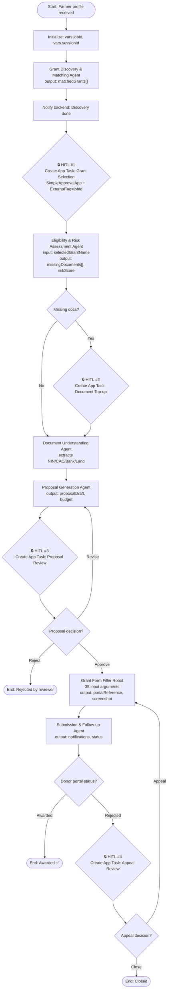

# The UiPath Brain: A Nine-Project Maestro Solution

This directory is the heart of AgriGrant AI. Every reasoning step, every state transition, every human pause-point, every screen-level interaction with an external portal happens here. The Python backend and the Next.js frontend are deliberately thin — they exist to ferry traffic to and from the UiPath platform, not to carry the business logic. **The business logic lives in this folder.**

The solution comprises **nine distinct UiPath projects**, each chosen as the correct primitive for its responsibility. We did not bend any of them. A Maestro process orchestrates because that is what Maestro is for. An Agent reasons because that is what Agents are for. The cross-platform RPA bot fills web forms because that is what unattended automation is for. The decisions are conscious.

---

## Solution Map

| # | Project | Type | Role in one sentence |
|---|---|---|---|
| 1 | **Nigerian AgriGrant Pipeline** | `ProcessOrchestration` (Maestro BPMN) | The conductor — the only project that knows how the other eight connect. |
| 2 | **Grant Discovery & Matching Agent** | `Agent` (Coded Agent) | Ranks live Nigerian grants against the farmer's profile and emits matchScore + matchReason per grant. |
| 3 | **Eligibility & Risk Assessment Agent** | `Agent` (Coded Agent) | Scores the farmer's compliance posture for the *selected* grant and emits a missing-documents list. |
| 4 | **Document Understanding Agent** | `Agent` (Coded Agent) | Extracts entities from uploaded NIN, CAC, bank statement, land doc — and cross-validates them. |
| 5 | **Proposal Generation Agent** | `Agent` (Coded Agent) | Drafts a full institutional-grade business proposal in the donor's preferred linguistic register. |
| 6 | **Submission & Follow-up Agent** | `Agent` (Coded Agent) | Plans the submission, drafts farmer-facing notifications, and on rejection drafts the appeal package. |
| 7 | **Grant Form Filler Robot** | `Process` (CrossPlatform, Unattended) | Headless RPA bot — 35 input arguments — that physically fills the institutional portal form. |
| 8 | **SimpleApprovalApp** | `WebApp` (UiPath Apps) | The Action Center carrier app for all four HITL checkpoints. |
| 9 | **AgriGrant API** | `Api` (UiPath API Project) | Internal API surface exposing pipeline + agent operations to the external FastAPI backend. |

All nine deploy to a single Orchestrator folder on tenant `hackathon26_384/DefaultTenant`.

---

## 1. Nigerian AgriGrant Pipeline (Maestro BPMN)

The orchestrator. A single `Process.bpmn` file that owns the entire farmer journey from intake to portal-reference-issued.

### Why Maestro and not a sequential Process
A grant journey is not a script. It branches (eligible / not eligible), it loops (revise proposal / re-submit), it pauses for days (human review, donor response), and it spans heterogeneous compute (Agent → Robot → App). Maestro is the only UiPath primitive that handles all four characteristics natively: stateful, durable, branchable, mixed-compute.

### Flow Walkthrough



### Critical BPMN design choices

| Decision | Rationale |
|---|---|
| All four HITLs use **native `Actions.HITL` activities** (Create App Task), not SendTask + CatchEvent | A SendTask is fire-and-forget — it does not block the instance. `Actions.HITL` genuinely suspends the Maestro instance, verifiable in the Instances view. This is the single biggest difference between a real orchestration and a demo. |
| **`ExternalTag = vars.jobId`** on every HITL | Lets the FastAPI backend filter pending tasks per-farmer with `?tag={jobId}`, achieving multi-tenant isolation at the platform level rather than the app level. |
| All HITLs bind to **one Action Center app** (SimpleApprovalApp), differentiated by `taskType` input | Avoids building four near-identical Apps. The Next.js dashboard dispatches to the right screen based on `taskType`. |
| **Mixed compute** — Agents and Robot side-by-side as activities | The BPMN does not care whether the next step is a reasoning model or a screen-scraper. Maestro abstracts the compute type away from the workflow. |
| **Variables carry state across pauses** — `selectedGrantName`, `missingDocuments`, `proposalDraft`, `appealDecision` | Each HITL's `CompleteAppTask` data merges back into the BPMN variable scope. The downstream agent reads from `vars.*` without knowing a pause happened. |

---

## 2. Grant Discovery & Matching Agent

* **Type:** Coded Agent
* **Role:** Stage 1 of the pipeline
* **Why an Agent:** Matching requires reasoning over fuzzy criteria (farm size brackets, target demographic overlap, geographic relevance, programmatic preference signals). A deterministic SQL query cannot capture intent — "this farmer is youth-adjacent and in a focus state for ACRESAL" — but a reasoning model can.

| Input | Source |
|---|---|
| `farmerProfile` (state, LGA, farmType, farmSize, crops, revenue, demographics) | Web app intake form |
| `grantDatabase` | Bundled knowledge + live web augmentation |

| Output | Consumed by |
|---|---|
| `matchedGrants[]` — each with `grantName`, `grantingOrganization`, `matchScore`, `matchReason`, `maxFundingNGN`, `submissionDeadline`, `submissionMethod`, `submissionPortalUrl`, `eligibilityCriteria` | HITL #1 (grant selection screen renders these as cards) |

---

## 3. Eligibility & Risk Assessment Agent

* **Type:** Coded Agent
* **Role:** Stage 2 of the pipeline
* **Why an Agent:** Eligibility is grant-specific and includes Nigerian-domain compliance reasoning — BVN status, CAC corporate registration, CRMS (Credit Risk Management System) clean record, cooperative membership, smallholder classification, youth/woman/PWD designation, land documentation provenance. The logic differs per grant and per state.

| Input | Source |
|---|---|
| `farmerProfile` | Pipeline vars |
| `selectedGrantName` | HITL #1 output |
| `selectedGrantCriteria` | Discovery agent output (passed through) |

| Output | Consumed by |
|---|---|
| `eligibilityVerdict` (`eligible` / `partial` / `ineligible`) | BPMN gateway |
| `missingDocuments[]` | HITL #2 (document top-up screen) |
| `riskScore` (0–100), `riskFactors[]` | Proposal Generation Agent (informs risk-mitigation language) |

---

## 4. Document Understanding Agent

* **Type:** Coded Agent (uses UiPath Document Understanding under the hood)
* **Role:** Stage 2 — runs after HITL #2 completes
* **Why an Agent and not just a DU activity:** Pure DU extracts fields. This agent goes further — it *cross-validates*. Does the name on the NIN match the name on the bank statement? Is the CAC registration date plausibly older than the cooperative membership date? Does the address on the land document fall inside the LGA the farmer claimed? That is reasoning, not extraction.

| Input | Source |
|---|---|
| `documentPaths` (NIN, CAC, bank statement, land doc) | HITL #2 output |

| Output | Consumed by |
|---|---|
| `extractedEntities` (name, DOB, BVN, CAC number, account number, land coordinates) | Proposal agent + Robot |
| `crossValidationResult` (`consistent` / `discrepancy_found`) + `discrepancies[]` | BPMN gateway (may loop back to HITL #2) |
| `documentVerdict` (`verified` / `needs_clarification`) | Pipeline state |

---

## 5. Proposal Generation Agent

* **Type:** Coded Agent
* **Role:** Stage 3
* **Why an Agent:** This is the highest-leverage moment in the pipeline. A 12-page formal business proposal — executive summary, problem statement, project description, SMART objectives, beneficiary analysis, implementation timeline, budget breakdown, sustainability plan, monitoring framework — has to be drafted in the *exact* register the specific grant expects. CBN ABP reads differently from IFAD reads differently from a state intervention. An LLM agent can switch registers; a template cannot.

| Input | Source |
|---|---|
| Verified `farmerProfile` + `extractedEntities` | Stage 2 output |
| `selectedGrantCriteria`, `selectedGrantOrganization` | Pipeline vars |
| `riskFactors[]` (to write defensively) | Eligibility agent |
| `projectIdea` (farmer's own words) | Web app intake |

| Output | Consumed by |
|---|---|
| `proposalDraft` (full structured doc) | HITL #3 (proposal review screen) |
| `requestedAmountNGN`, `budgetBreakdown` | Robot (form filling) |
| `projectTitle` | Robot + pipeline metadata |

---

## 6. Submission & Follow-up Agent

* **Type:** Coded Agent
* **Role:** Stage 5 (post-submission concierge)
* **Why an Agent:** Post-submission, the work is not over. The agent has to (a) generate farmer-facing notifications in plain Nigerian English, (b) schedule a reminder cadence appropriate to the donor's typical processing window, (c) draft a follow-up email and phone script if the donor's status changes to "pending clarification", and (d) if the donor rejects, scrape the rejection reason and package an appeal recommendation for HITL #4. Each of those is a generative task.

| Input | Source |
|---|---|
| `portalReference`, `submissionStatus`, `screenshotPath` | Grant Form Filler Robot output |
| Donor portal status (polled later) | Robot or HTTP probe |

| Output | Consumed by |
|---|---|
| Notifications (SMS + email body) | External delivery (backend) |
| Follow-up schedule | Pipeline timer events |
| `appealRecommendation` (if rejected) | HITL #4 |

---

## 7. Grant Form Filler Robot

* **Type:** Cross-platform `Process` (unattended RPA)
* **Project ID:** `ccf81901-63f9-4c79-9173-23e6b6565c7d`
* **Role:** Stage 4 — the executioner
* **Why a Cross-platform Process and not an Agent:** Filling a poorly-designed institutional portal is **not a reasoning problem**. It is a deterministic, repeatable, screen-level interaction — exactly what unattended RPA was invented for. Putting an LLM in this loop would add latency and reduce reliability.

### Input arguments (35 total — comprehensive)

The robot is parameterised against the *entire* farmer profile so that one bot serves every grant portal we onboard:

| Group | Arguments |
|---|---|
| **Identity** | `in_farmerName`, `in_farmerEmail`, `in_farmerPhone` |
| **Geography** | `in_stateOfResidence`, `in_lga`, `in_farmLocation` |
| **Operation** | `in_farmType`, `in_farmSizeHectares`, `in_cropOrLivestockTypes`, `in_yearsInOperation`, `in_annualRevenueNGN` |
| **Application** | `in_grantProgram`, `in_requestedFundingAmountNGN`, `in_proposedProjectDescription` |
| **Compliance flags** | `in_hasBVN`, `in_hasCACRegistration`, `in_isMemberOfCooperative`, `in_hasLandDocument`, `in_isSmallholderFarmer`, `in_isYouthFarmer`, `in_isWomanFarmer`, `in_hasNoLoanDefault` |
| **Document paths** | `in_ninDocumentPath`, `in_cacDocumentPath`, `in_bankStatementPath`, `in_landDocumentPath` |
| **Submission control** | `in_additionalNotes`, `in_declarationAgreed`, `in_targetPortalURL` |

### Output arguments

| Argument | Purpose |
|---|---|
| `out_portalReference` | The donor's tracking number — proof of submission |
| `out_submissionStatus` | `Success` / `PartialSuccess` / `Failed` |
| `out_screenshotPath` | Path to the success-page screenshot for audit |
| `out_errorMessage` | Populated on failure for HITL #4 escalation |

The robot navigates the configured `in_targetPortalURL`, completes a multi-page form, uploads the four document files, accepts the declaration, submits, captures the success page, and emits the reference number.

---

## 8. SimpleApprovalApp (Action Center Web App)

* **Type:** `WebApp` (UiPath Apps)
* **Role:** The blocker. The carrier. The queue.

This app is deliberately minimal because the rich UI lives in the farmer's Next.js dashboard. SimpleApprovalApp's only responsibilities are:

1. **Block the Maestro instance** when invoked from `Actions.HITL`.
2. **Carry inputs** that the web frontend reads to know what kind of decision to render.
3. **Emit outputs** that the BPMN reads to drive the next branch.

### App contract

| App Input | Type | Set by BPMN to |
|---|---|---|
| `sessionId` / `jobId` | string | `=vars.jobId` |
| `taskType` | string | literal — one of `grant-selection`, `document-topup`, `proposal-review`, `appeal` |
| `payload` | string (JSON) | `JSON.stringify` of the variables that screen needs |

| App Output | Mapped to BPMN variable |
|---|---|
| `selectedGrantName` | `vars.selectedGrantName` (HITL #1) |
| `uploadedDocumentsJson` | `vars.uploadedDocumentsJson` (HITL #2) |
| `proposalDecision` | `vars.proposalDecision` (HITL #3) — `approve` / `revise` / `reject` |
| `appealDecision` | `vars.appealDecision` (HITL #4) — `appeal` / `close` |

| App Outcome | When |
|---|---|
| `Approved` | Farmer/specialist submits a positive decision |
| `Rejected` | Farmer/specialist explicitly rejects |

---

## 9. AgriGrant API (UiPath API Project)

* **Type:** `Api`
* **Role:** Internal API surface that the external FastAPI backend can call as a structured contract — rather than hand-rolling Orchestrator OData calls.

This is the project that lets us evolve the orchestration internals (rename a variable, refactor a gateway) without forcing the Python backend or the Next.js frontend to change. The API project is the **stable façade**; everything behind it is free to move.

---

## The Four HITL Checkpoints, Summarised

| # | Where | Decision required | Inputs to the human | Output back to pipeline |
|---|---|---|---|---|
| 1 | After Grant Discovery | Which grant should we pursue? | `matchedGrants[]` with scores and reasons | `selectedGrantName` |
| 2 | After Eligibility | Upload the missing documents | `missingDocuments[]` | `uploadedDocumentsJson` |
| 3 | After Proposal Generation | Approve / revise / reject the draft | `proposalDraft`, `budgetBreakdown` | `proposalDecision` |
| 4 | After Donor Rejection (conditional) | File an appeal or close the application | `rejectionReason`, `appealRecommendation` | `appealDecision` |

Every checkpoint pauses the Maestro instance with `Actions.HITL`. None of them is a webhook. All four are visible as paused instances in the Maestro Instances view — the cleanest possible proof to a judge that the orchestration is real.

---

## Deployment

1. **Open the solution** (`Solution1`) in UiPath Studio Desktop or Studio Web.
2. **Publish each of the nine projects** to the target Orchestrator tenant. Bump the package version on each publish so judges can see release history.
3. **Confirm the BPMN's four `Create App Task` activities** all reference `SimpleApprovalApp` with:
   * **Task Title** — descriptive (e.g. `Grant Selection for {{vars.farmerName}}`)
   * **External Tag** — `=vars.jobId`
   * **App Inputs** — `sessionId`, `taskType` (literal per node), `payload` (JSON.stringify of needed vars)
   * **App Outputs** — mapped to the correct downstream `vars.*`
4. **Configure the Robot's target portal URL** as a default argument or asset (`in_targetPortalURL`).
5. **From the backend host, probe connectivity:**
   ```bash
   curl http://localhost:8000/v1/api/hitl/health
   ```
6. **Run a test farmer through the pipeline.** Watch the Maestro Instances view — you will see four genuine pause-points where the process waits for a human. That visual is the demo.
