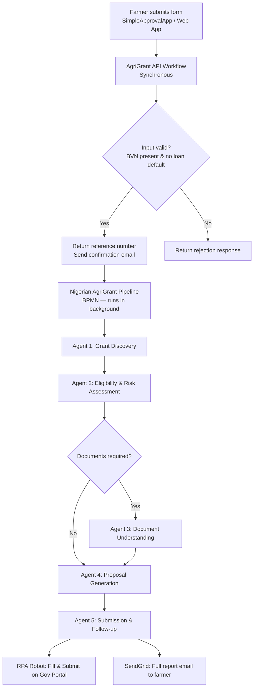
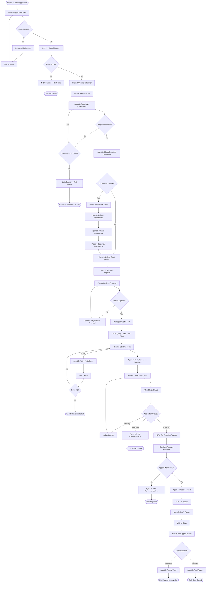

# AgriGrant AI — UiPath Automation

This folder contains all UiPath components that power the AgriGrant AI backend: five AI agents, a BPMN orchestration pipeline, a synchronous API workflow, an RPA robot, and a UiPath App frontend.

---

## Folder Structure

```
UiPath-automation/
├── AgriGrant API/                     # Synchronous API workflow
├── Grant Discovery & Matching Agent/  # Agent 1
├── Eligibility & Risk Assessment Agent/ # Agent 2
├── Document Understanding Agent/      # Agent 3
├── Proposal Generation Agent/         # Agent 4
├── Submission & Follow-up Agent/      # Agent 5
├── Nigerian AgriGrant Pipeline/       # BPMN orchestration (Process.bpmn)
├── Grant Form Filler Robot/           # RPA desktop robot
└── SimpleApprovalApp/                 # UiPath App (farmer-facing frontend)
```

---

## How It All Connects



---

## Components

### AgriGrant API Workflow

**Type:** UiPath Studio Web — API Project  
**File:** `AgriGrant API/Workflow.json`

This is the synchronous entry point. When a farmer submits their application, this workflow runs immediately and responds before the full pipeline starts.

What it does:
1. Receives the farmer's form data
2. Generates a unique reference number (`AGRI-<timestamp>`)
3. Checks minimum acceptance criteria — farmer must have a BVN and no existing loan default
4. Returns `ACCEPTED` or `REJECTED` with the reference number
5. Triggers a confirmation email via SendGrid

**Key inputs:** `farmerName`, `hasBVN`, `hasExistingLoanDefault`, `proposedProjectDescription`, `farmLocation`, `farmType`, and more.

**Key outputs:** `applicationRef`, `status` (`ACCEPTED` / `REJECTED`), `farmerName`

---

### Nigerian AgriGrant Pipeline

**Type:** UiPath BPMN Process Orchestration  
**File:** `Nigerian AgriGrant Pipeline/Process.bpmn`

This is the core background pipeline. It orchestrates all five agents in sequence, handles branching logic (documents required or not, grants found or not), manages retries on portal failures, and monitors application status after submission.



---

### The Five Agents

All agents are built on **UiPath Agentic Automation** and powered by GPT-4o / Claude via UiPath GenAI.

| # | Agent | What It Does | Key Output |
|---|-------|-------------|-----------|
| 1 | Grant Discovery & Matching | Searches the web for Nigerian agricultural grants matching the farmer's profile | `matchedGrants[]`, `topRecommendation`, `profileGaps` |
| 2 | Eligibility & Risk Assessment | Scores the farmer 0–100 against Nigerian compliance requirements. Hard disqualifiers enforced (no BVN, loan default, no CAC) | `overallEligibilityScore`, `eligibilityVerdict`, `nigerianComplianceFlags`, `strengths`, `riskFactors` |
| 3 | Document Understanding | Extracts and validates uploaded Nigerian identity and compliance documents. Cross-references for inconsistencies | `documentResults[]`, `consolidatedFarmerProfile`, `overallDocumentScore`, `documentVerdict` |
| 4 | Proposal Generation | Writes complete, print-ready application letters tailored to specific Nigerian grant bodies | `applicationLetters[]`, `fullProposalText`, `preparationChecklist`, `budgetBreakdown` |
| 5 | Submission & Follow-up | Builds the submission package, sends confirmation/rejection messages, generates reminders, handles appeals | `submissionPackage`, `confirmationPackage`, `reminderSchedule`, `trackingAndFollowUp` |

---

### Grant Form Filler Robot

**Type:** UiPath Studio Desktop — Attended / Unattended RPA  
**File:** `Grant Form Filler Robot/Main.xaml`

A desktop robot that automates direct form submission on Nigerian government grant portals. It receives structured farmer data from the pipeline and handles the browser automation.

What it does:
- Opens Chrome and navigates to the target portal
- Fills all form fields from the structured data package
- Uploads supporting documents
- Flags CAPTCHAs for human intervention (attended mode)
- Reads the confirmation/reference number from the success page
- Returns the reference back to the pipeline so AgriGrant AI can email the farmer

Target portals: NIRSAL, CBN Anchor Borrowers Platform, BOA, State Ministry of Agriculture websites, FMARD.

---

### SimpleApprovalApp

**Type:** UiPath App (low-code frontend)  
**File:** `SimpleApprovalApp/Main.xaml`

A UiPath-native App that serves as a farmer-facing frontend. It connects directly to the AgriGrant API workflow and the pipeline without needing a custom web server.

What it provides:
- Multi-step farmer intake form
- Real-time application status display
- Application letter download
- Approve / Reject action buttons (for human-in-the-loop review tasks)

---

## Eligibility Scoring Logic (Agent 2)

| Category | Weight |
|----------|--------|
| Farm Profile Alignment | 25% |
| Project Relevance | 25% |
| Financial Eligibility | 20% |
| Compliance & Planning | 15% |
| Documentation Readiness | 15% |

Hard disqualifiers applied before scoring:

- No BVN → compliance score capped at 20
- Existing CBN/NIRSAL loan default → overall score forced to 0
- No CAC registration (when grant requires it) → score capped at 25

---

## Supported Documents (Agent 3)

NIN Slip, Voter Card (PVC), International Passport, Driver's Licence, Certificate of Occupancy (C of O), Right of Occupancy (R of O), Survey Plan, CAC Certificate, Bank Statement, NIRSAL/CBN Loan Documents, Cooperative Certificate, NAFDAC Permit.

---

## Email Delivery

| Stage | Trigger | Content |
|-------|---------|---------|
| Immediate | API Workflow completes | Reference number + draft letter + confirmation |
| Full Report | Pipeline completes | Matched grants, eligibility score, final letter, submission instructions |

Provider: SendGrid (`info@agrigrant.xyz`)

---

## Running Locally

These components run on **UiPath Automation Cloud**. To deploy:

1. Publish the solution from UiPath Studio Web to your Automation Cloud tenant
2. Set the required bindings (folder paths) for each agent and the pipeline in `SolutionStorage.json`
3. Configure environment credentials in your tenant (SendGrid API key, process keys)
4. Trigger the API workflow via HTTP POST or through the SimpleApprovalApp

> For the RPA robot (Grant Form Filler), publish separately from UiPath Studio Desktop and assign to an Unattended or Attended robot in Orchestrator.
