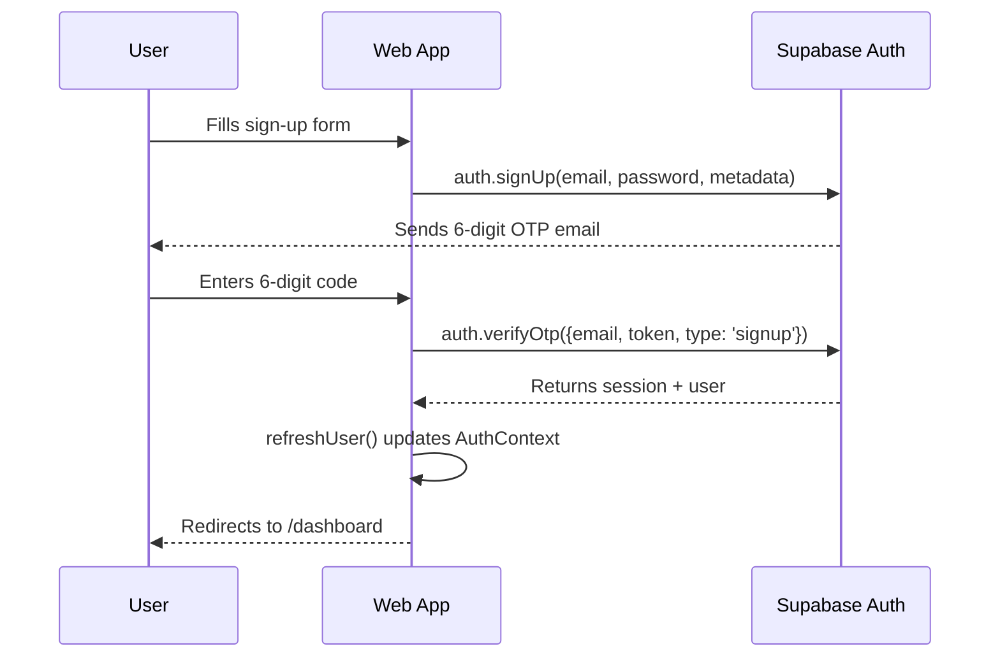

# AgriGrant AI — Web App

The customer-facing web application for **AgriGrant AI**, a platform that helps Nigerian smallholder farmers discover, qualify for, and apply to agricultural grants in under 10 minutes.

Built with **Next.js 15 (App Router)**, **React 19**, **TypeScript**, **Tailwind CSS**, and **Supabase Auth**. Talks to the FastAPI backend at `https://api.agrigrant.xyz/v1`.

---

## Tech Stack

| Layer | Choice |
|---|---|
| Framework | Next.js 15.5 (App Router) |
| Language | TypeScript 5 |
| UI | React 19 + Tailwind CSS 3.4 |
| Auth | Supabase (`@supabase/supabase-js`) |
| Forms | React Hook Form |
| Charts | Recharts |
| Icons | Lucide React + Heroicons |
| Markdown | React Markdown + remark-gfm |
| Toasts | Sonner |
| Hosting | Vercel (Production) |

---

## Getting Started

### Prerequisites

- **Node.js 20+**
- **npm 10+** (or pnpm / yarn)

### Install & run

```bash
cd web
npm install
cp .env.example .env.local   # then fill in the values below
npm run dev
```

App runs at **http://localhost:4028**.

### Required environment variables

Create `web/.env.local`:

```env
# Supabase (anon key only — service_role MUST stay on the backend)
NEXT_PUBLIC_SUPABASE_URL=https://YOUR-PROJECT.supabase.co
NEXT_PUBLIC_SUPABASE_ANON_KEY=eyJhbGciOi...

# AgriGrant AI Backend
NEXT_PUBLIC_API_URL=https://api.agrigrant.xyz/v1

# Public site URL (used for OAuth redirects, share links)
NEXT_PUBLIC_SITE_URL=https://agrigrant.xyz
```

> **Where to find these:** Supabase Dashboard → Project Settings → API → copy `Project URL` and `anon public` key.

---

## Available Scripts

| Command | What it does |
|---|---|
| `npm run dev` | Starts the dev server on port 4028 |
| `npm run build` | Production build (`next build`) |
| `npm run serve` | Starts the built app (`next start`) |
| `npm run lint` | Runs ESLint |
| `npm run lint:fix` | Auto-fixes lint issues |
| `npm run format` | Prettier formats `src/**` |
| `npm run type-check` | TypeScript check without emitting files |

---

## Project Structure

```
web/
├── src/
│   ├── app/
│   │   ├── components/             # Landing-page sections
│   │   ├── dashboard/              # Authenticated farmer dashboard
│   │   │   ├── applications/
│   │   │   ├── grants/
│   │   │   ├── proposals/
│   │   │   ├── chat/
│   │   │   ├── vault/
│   │   │   └── settings/
│   │   ├── farmer-portal/          # Multi-step intake & live results
│   │   ├── grant/[id]/             # Grant detail view
│   │   ├── sign-up-login-screen/   # Auth (sign-up, login, OTP)
│   │   ├── terms-of-service/
│   │   ├── privacy-policy/
│   │   ├── layout.tsx              # Root layout (Auth + Theme + Toasts)
│   │   └── not-found.tsx
│   ├── components/ui/              # Shared building blocks
│   ├── context/                    # AuthContext, ThemeContext, PortalResultsContext
│   ├── lib/
│   │   ├── supabaseClient.ts       # Lazy Supabase client (build-safe)
│   │   └── api.ts                  # Backend fetch wrapper
│   └── styles/
└── public/assets/
```

### Key files

- **`src/lib/supabaseClient.ts`** — Lazy proxy. Doesn't throw at build time if env vars are missing, so `next build` can prerender static pages even when env vars are injected only at runtime.
- **`src/context/AuthContext.tsx`** — Wraps Supabase auth, exposes `useAuth()` and `useUser()` hooks.
- **`src/app/sign-up-login-screen/`** — Email + password sign-up that triggers a 6-digit OTP from Supabase. The OTP email is branded — see Supabase Dashboard → Authentication → Email Templates.

---

## Authentication Flow



> **Email OTP must be enabled** in Supabase → Authentication → Providers → Email → "Enable Email OTP". Otherwise users get magic-link emails instead of 6-digit codes.

---

## Backend Integration

The web app calls the FastAPI backend at `NEXT_PUBLIC_API_URL`. Key endpoints:

| Action | Method + Path |
|---|---|
| Submit grant application | `POST /api/pipeline/submit` |
| Poll pipeline status | `GET /api/pipeline/status/{job_id}` |
| Resubmit | `POST /api/pipeline/resubmit` |
| Full history | `GET /api/pipeline/full-history/{user_id}` |
| Start chat session | `POST /api/chat/start` |
| Send chat message | `POST /api/chat/message` |
| Get chat history | `GET /api/chat/history/{session_id}` |

---

## Deployment (Vercel)

1. **Import** the repo into Vercel → set **Root Directory** to `web`
2. **Environment Variables** (Settings → Environment Variables) — add all four from the `.env.local` block above for Production, Preview, **and** Development
3. **Build** auto-runs `npm run build`; Vercel auto-detects Next.js
4. **Custom domain** — `agrigrant.xyz` is configured via CNAME on Spaceship

> ⚠️ `NEXT_PUBLIC_*` variables are inlined at **build time**. After changing them in Vercel you **must redeploy** (Deployments → ⋯ → Redeploy → uncheck "Use existing build cache") for the change to take effect on the live site.

---

## Common Tasks

### Update a Supabase email template

Supabase Dashboard → Authentication → Email Templates → pick template (Confirm signup, Magic Link, Reset Password). Use `{{ .Token }}` for OTP and `{{ .ConfirmationURL }}` for links — these are Go template variables, not React props.

### Add a new dashboard page

1. Create `src/app/dashboard/<slug>/page.tsx`
2. Add a sidebar item in `src/app/dashboard/Components/DashboardSidebar.tsx`
3. Wire any backend calls through `src/lib/api.ts`

### Debug a 500 from the backend

Open DevTools → Network → click the failed request → check the response body. Most issues stem from an env var typo, an expired Supabase JWT, or the Render service cold-starting (first request after idle takes ~30s on the free tier).

---

## Troubleshooting

| Symptom | Likely cause | Fix |
|---|---|---|
| `Supabase is not configured` runtime error | `NEXT_PUBLIC_SUPABASE_*` env vars missing on Vercel | Add them, then redeploy without build cache |
| Build fails on `/_not-found` prerender | Same as above on first deploy | Add env vars + redeploy |
| OTP email never arrives | Supabase free-tier rate limit | Configure SendGrid SMTP in Supabase → Auth → SMTP Settings |
| API calls return CORS error | Wrong `NEXT_PUBLIC_API_URL` or backend `CORS_ORIGINS` mismatch | Confirm both ends use `https://agrigrant.xyz` (no trailing slash) |
| Dashboard hangs on first load after idle | Render free-tier cold start | Wait ~30s, or add UptimeRobot to ping `/v1/health` every 5 min |

---

## License

Built by **REM Labs** for the Nigerian farmer ecosystem · UiPath Agentic Automation hackathon entry.
